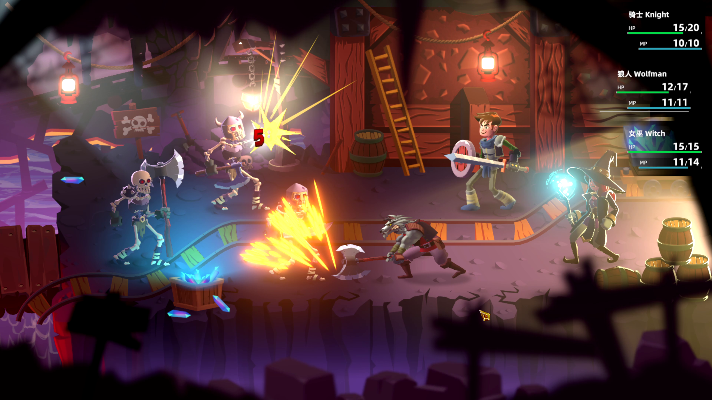
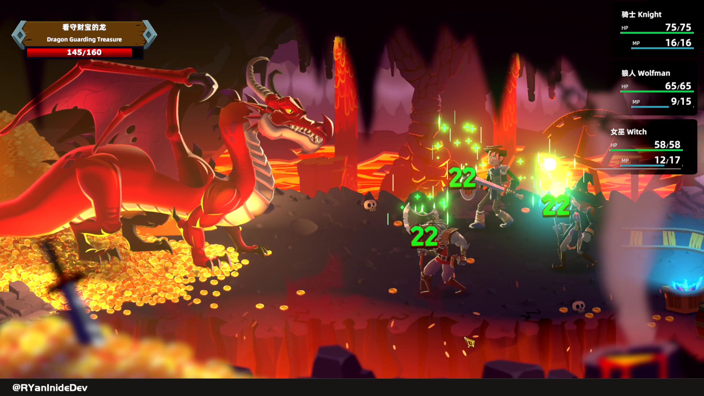
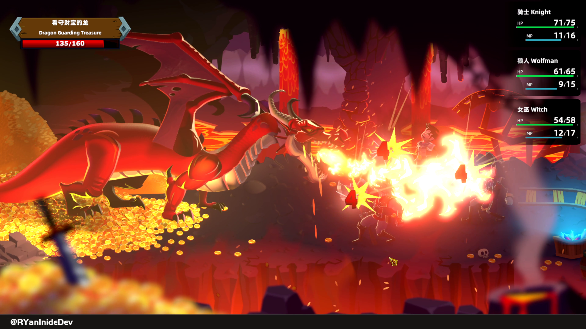
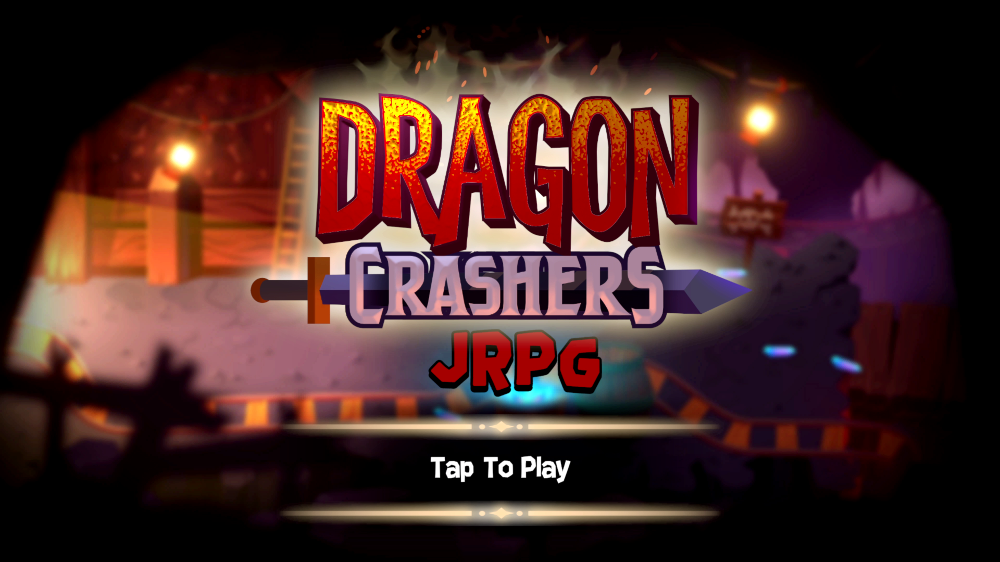

# Introduction of Dragon Crasher JRPG Demo

<iframe width="560" height="315" 
src="https://www.youtube.com/embed/DxM4bM3-O10?si=ReUdVcL8SBocIRDZ" 
title="YouTube video player" frameborder="0" allow="accelerometer; 
autoplay; clipboard-write; encrypted-media; gyroscope; picture-in-picture; 
web-share" referrerpolicy="strict-origin-when-cross-origin" allowfullscreen>
</iframe>

## 新的JRPG战斗系统

Dragon Crashers是Unity官方的2D游戏演示项目，原来的版本是一个典型的没什么游戏体验的手机游戏。它的Gameplay就是简单的哪个技能亮了就按哪个。

但是，经过我的改造，现在它拥有了经典的JRPG战斗系统。

## 自定义角色技能系统

除了战斗系统的改进，我还实现了新的自定义技能系统。每个角色都拥有独特的技能和特性。通过这个系统，我添加了一个原版所没有的回血技能。

## 数据驱动的属性系统

为了提高开发的灵活性，我采用了数据驱动的属性系统。这意味着角色的属性和能力可以通过数据来配置，使得调整和平衡游戏变得更加简便。

## 试玩版上线

为了让大家亲身体验DragonCrashersJRPG版，阿严制作了本项目的试玩版。
你可以通过页面下方的链接下载并尝试本游戏Demo。
如果你被新的JRPG战斗系统所吸引，那么别忘了下载试玩版。

[⏬ 试玩版下载 ⏬](https://github.com/RYanXuDev/RYanXuDev.github.io/raw/main/projects/unity/dragon-crashers-jrpg/RYanIndieDev-DragonCrashersJRPG_Windows_V0.2.zip)

----

2024-01-19 阿严
