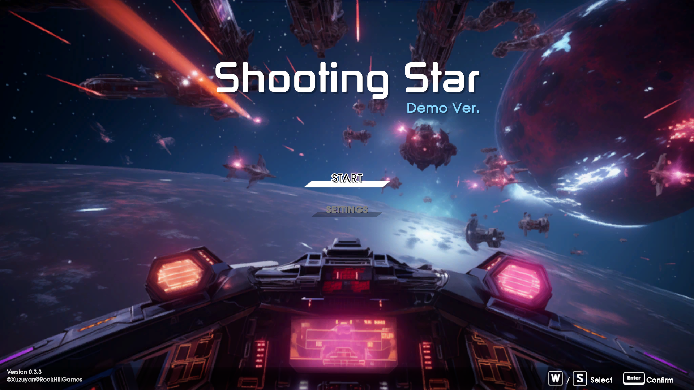
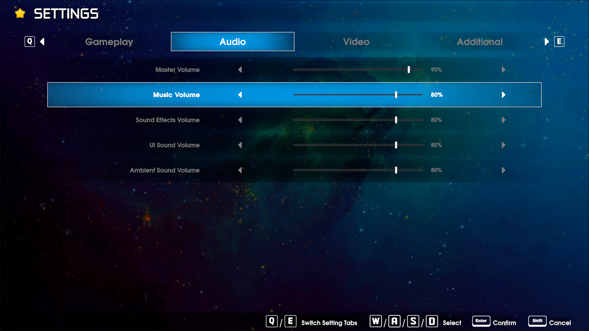
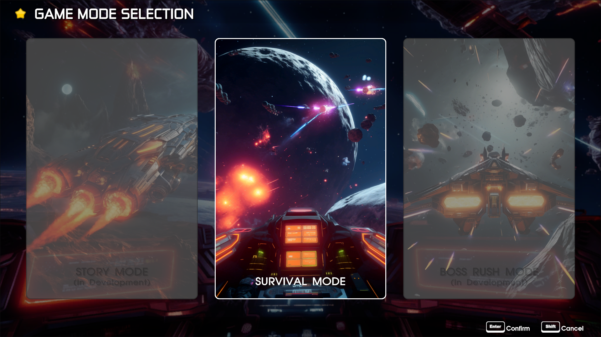
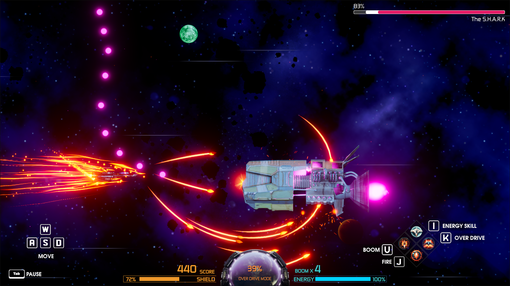
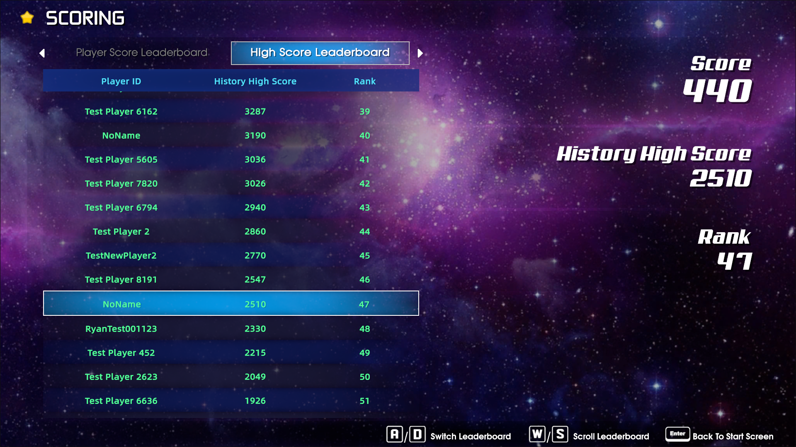

# Introduction of Shooting Star V0.3 Major Update

## 简介 

"Shooting Star" 是我最早制作的 Unity 教程项目。 现在回头看，这个项目多少显得有些稚嫩。 经过两年多的学习和开发实践，我觉得有必要对这个项目进行一次较大的更新。 因此，在准备了一段时间后，我推出了该项目的 0.3 版本。 在这次更新中，我彻底重构了游戏的 UI，并新增了在线排行榜和保存游戏设置的功能。 此外，我还对游戏机制进行了一些改进，为之后的更新打下了一些基础。

## UI重制

- 除了角色的浮动血条之外，我使用了最新版本的 Unity UI Toolkit 对项目中的所有 UI 进行了重制。 这是一次从 UGUI 迁移到 UI Toolkit 的新尝试，总体上效果还是挺不错的。

## 新增功能

- 在线排行榜：现在，玩家在生存模式下的最终得分会上传到网络，允许他们在每次游戏结束后查看排行榜上的排名。 前 100 名玩家将显示在高分排行榜上。
- 保存游戏设置：玩家的偏好设置现在会保存在本地，确保他们下次启动游戏时能自动应用之前保存的游戏设置。

## 玩法改进

- 引入超载系统：现在，当玩家的子弹命中敌机时，会积累超载值。 一旦超载槽达到 100%，玩家可以按下相应的按键激活超载模式，再次按下该按钮则可以随时取消超载。
- 能量管理调整：我对之前用来触发超载模式的能量系统进行了调整。 现在，玩家的能量值在未满时将会自动缓慢地恢复。而使用任何能量消耗技能依然会消耗能量。

## 试玩版同步上线

我制作了该新版本的试玩版。游戏的下载链接可以在下方找到。 同时，我还制作了 WebGL 平台的试玩版。假如您不方便下载游戏，也可以直接在我的个人网页上试玩。 如果您感兴趣的话，还请务必尝试一下。

- 试玩版下载
    - [Windows](../../../projects/unity/shooting-star/RYanXuDev_ShootingStar_V0.3.3_Windows_Development.zip)
    - [Mac](https://github.com/RYanXuDev/RYanXuDev.github.io/raw/main/projects/unity/shooting-star/RYanXuDev_ShootingStar_V0.3.3_Mac_Development.zip)
- [在我的网页上试玩](https://ryanxudev.github.io/)

----

阿严 2024-04-01

----

## Intro

"Shooting Star" is one of my earliest Unity tutorial projects, and looking back, it seems a bit naive compared to my current work.  
After over two years of learning and development practice, I felt it was necessary to give this project a major update.  Therefore, after some preparation, I am pleased to announce the release of version 0.3 of this project.  
In this update, I have completely redesigned the game's UI, introduced online leaderboards, and added a feature to save game settings.  
Additionally, I have made some improvements to the game mechanics to lay a foundation for future updates.

## UI Redesign

- With the exception of the character's floating health bar, I have revamped all UI elements in the project using the latest version of the Unity UI Toolkit. This marks a new attempt to migrate from UGUI to the UI Toolkit, and overall, the results have been quite promising.

## New Features

- Online Leaderboards: Players' final scores in survival mode are now uploaded to the network, allowing them to view their rankings on the leaderboard after each game.  
The top 100 players will be displayed on the high score leaderboard.
- Game Settings Saving: Players' preference settings are now saved locally, ensuring that their game settings will be automatically applied the next time they start the game.

## Gameplay Improvements

- Introduction of the Over Drive System: Players accumulate Over Drive points when their projectiles hit enemy.  Once the Over Drive gauge reaches 100%, players can activate Over Drive mode by pressing the corresponding button.  Pressing the button again cancels Over Drive mode at any time.
- Energy Management Adjustment: I have made adjustments to the energy system previously used to trigger Over Drive mode.  Now, players' energy will slowly regenerate when not at full capacity. Using any energy-consuming skills will still deplete energy.

## Playable Demo Synchronized Release

I have also created a playable demo of the new version. You can find the download link below.  Additionally, I have created a WebGL version of the demo, so if you prefer not to download the game, you can try it directly on my website.  If you're interested, be sure to give it a try.

- Playable Demo Download
    - [Windows](../../../projects/unity/shooting-star/RYanXuDev_ShootingStar_V0.3.3_Windows_Development.zip)
    - [Mac](https://github.com/RYanXuDev/RYanXuDev.github.io/raw/main/projects/unity/shooting-star/RYanXuDev_ShootingStar_V0.3.3_Mac_Development.zip)
- [Play the WebGL version Demo on my website](https://ryanxudev.github.io/)

----

RYan 2024-04-01
