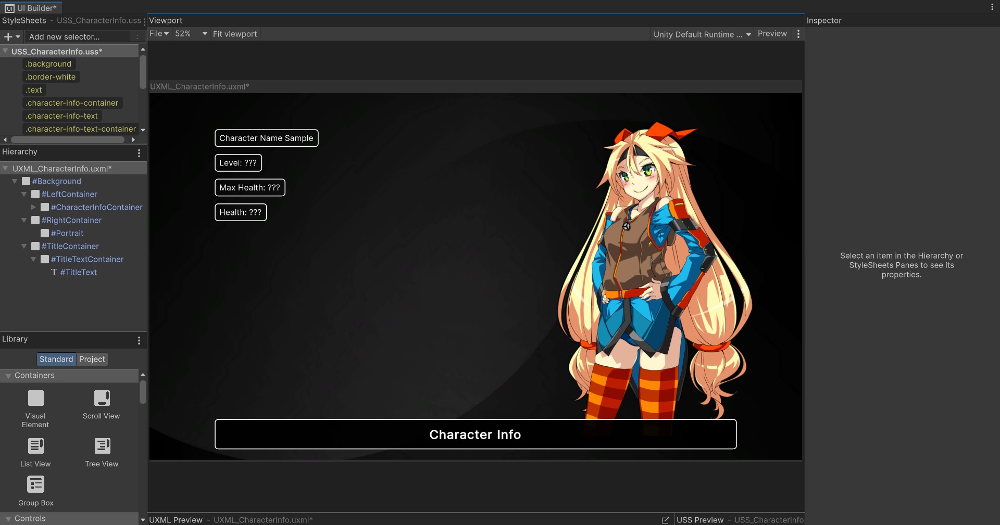
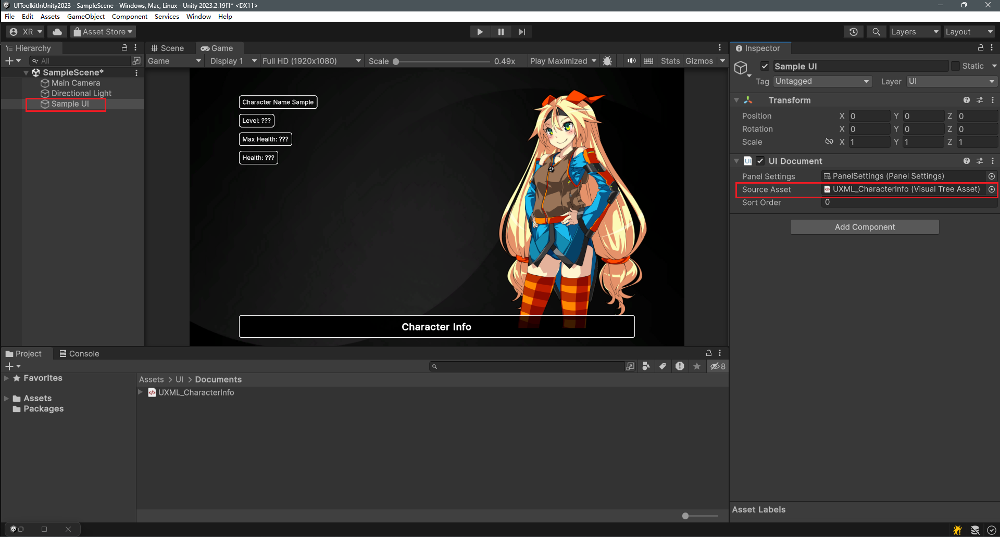
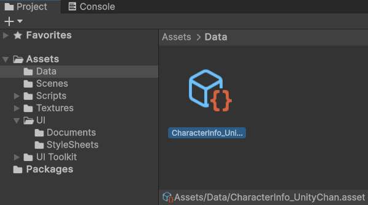
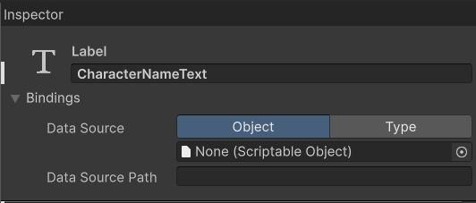
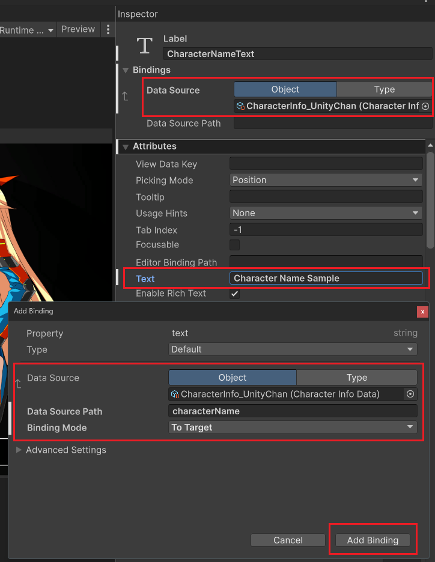

# UI Toolkit New Features Part 1

## Introduction

Yes, indeed!  
The UI Toolkit in Unity introduced some key new features after version 2023.2.  
This tutorial will cover the most significant improvements, including:

- New data binding methods
- Simplified custom control creation
- Usage methods for some new attributes

This tutorial will provide detailed explanations of these new features through practical examples.

---

- [Example project files download](https://www.patreon.com/posts/unity-ui-toolkit-102677647?utm_medium=clipboard_copy&utm_source=copyLink&utm_campaign=postshare_creator&utm_content=join_link)

---

- Tutorial recording live stream:

  - [Day 1](https://www.patreon.com/posts/unity-ui-toolkit-102799835?utm_medium=clipboard_copy&utm_source=copyLink&utm_campaign=postshare_creator&utm_content=join_link)
  - [Day 2](https://www.patreon.com/posts/unity-ui-toolkit-102845772?utm_medium=clipboard_copy&utm_source=copyLink&utm_campaign=postshare_creator&utm_content=join_link)

---

- Tutorial Videos
  - Part 1
    - [YouTube](https://youtu.be/cbQJq_O3ZEo)
    - [Bilibili](https://www.bilibili.com/video/BV1Jr421g7Lr/)

---

The tutorial consists of three parts, and this is the first part, focusing on:

- Preparation of example project
- One of the new data binding methods: Binding Scriptable Objects via the UI Builder

## Preparation of Example Project

First, let's talk about the engine version used in the example project.  
I'm using the latest release of the Unity Editor.  
As mentioned earlier, the new features of the UI Toolkit were added after version 2023.2.  
Therefore, if you want to follow along, remember to use the latest release version of the Unity Editor.

Firstly, I created a UXML, which is a simple Character Info screen.



I won't explain the UI building process here, as I have detailed explanations in my previous video tutorials.  
If you need to learn from scratch how to create UI using the UI Builder, you can refer to my previous video tutorials:

- [YouTube](https://www.youtube.com/playlist?list=PLrn_k3ArwNC1l_upOeWPdfRyLcXBuE-tx)
- [Bilibili](https://www.bilibili.com/video/BV1pK411m7n9/)

In the example scene, I created a game object with a UI Document component.  
(right-click in the Hierarchy - UI Toolkit - UI Document)  
I named it Sample UI.  
I set the Source Asset of the UI Document component to the UXML file we created for the Character Info screen,  
so the UI will be displayed in the game window.



Then, I wrote a C# class named CharacterInfoData.

```C#
using UnityEngine;

[CreateAssetMenu(fileName = "CharacterInfo_", menuName = "Data/Character Info")]
public class CharacterInfoData : ScriptableObject
{
    [SerializeField] string characterName;

    [SerializeField, Min(0)] int characterLevel;

    [SerializeField, Min(0)] int characterMaxHealth;

    [SerializeField, Min(0)] int characterHealth;
}
```

This is a Scriptable Object used to simulate character stats data in the game. It holds:

- Character name (characterName)
- Character level (characterLevel)
- Character maximum health (characterMaxHealth)
- Character current health (characterHealth)

These four fields correspond to the four UI elements that need to be bound in our Character Info screen.  
Here, I marked these four private fields with `[SerializeField]` attribute to serialize them.  
One of the benefits of serialized fields is that we can directly assign values to them in the editor.

Next, I created the SO asset file for this class in the editor.



Now our initial project is ready.

## New Data Binding Method

In the new version of UI Toolkit, developers can now bind data more flexibly, greatly simplifying the process of UI data binding.  
There are three main ways to achieve this:

- Add data sources and bind data directly in the UI Builder
- Add corresponding data binding content in UXML
- Call VisualElement.SetBinding() method in C# script to set bindings for UI elements

## Binding SO in UI Builder

In the new version of the UI Builder, when we click on a UI element, we can find a "Bindings" option at the top of the Inspector.  
Let's take the character name text label (CharacterNameText) in the Character Info screen as an example:



Here we can set the data source for this UI element.  
We can choose to use a SO or a Type as the data source.  
Here, we use the CharacterInfoData SO we created earlier.  
Then, right-click on the Text property of this label, and you will find a new option "Add Binding...".  
Clicking on it will open the window for adding binding to this property.

In this window, the data source has been automatically added to be the CharacterInfoData SO we just selected.  
We can also choose other data sources to override the original data source.  
When the data source is not empty, clicking on the Data Source Path allows us to select a property from the data source as the data source path for this text property.  
Here, we choose the `characterName`, which is a string type serialized field.  
Finally, click the "Add Binding" button in the lower right corner.



Now, we have completed the binding of the Text property of the CharacterNameText label to the `characterName` property in the SO.  
You can see that the content of this text property and the character name in the viewport have been updated to the value of the `characterName` field in the SO.  
Saving UXML and returning to the editor, the UI in the game window has also been updated.

It's quite amazing that when we modify the value of `characterName` property in the SO in the editor, even without running the game, the UI in the game window will be updated in real-time.  
If we bind the UI property to a Type, then we can only observe the UI changes when the data in the bound class changes during the game.  
This is one of the advantages of binding to a SO compared to binding to a Type.  
It's very useful for both programmers and non-programming designers.  
Therefore, I personally recommend using the method of binding to SO for UI data binding.

## Conclusion

This concludes the first part of the tutorial.  
Thank you for watching.  
In the next part, we will learn about several new features and the other two data binding methods.

- [UI Toolkit New Features Part 2]()

---

RYan Xu 2024-04-23
