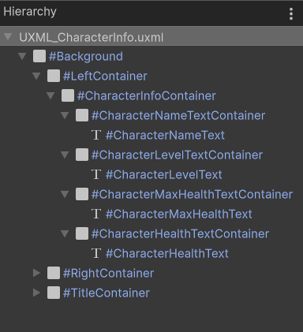
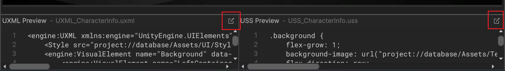

# UI 工具包新功能·Part 2

## 引言

Yes, indeed!  
Unity的UI工具包 (UI ToolkitUI) 在2023.2版本之后引入了一些关键的新功能。  
本教程将涵盖其中最主要的改进内容，包括：

- 新的数据绑定 (Data Binding) 方式
- 简化的自定义控件 (Custom Control) 创建方式
- 一些新特性 (Attribute) 的使用方法

本教程将结合实际案例来详细的讲解这些新的功能。

---

示例工程文件下载：

- [Patreon](https://www.patreon.com/posts/unity-ui-toolkit-102677647?utm_medium=clipboard_copy&utm_source=copyLink&utm_campaign=postshare_creator&utm_content=join_link)
- [爱发电](https://afdian.net/p/379c052cfe9311ee8c5652540025c377)

---

教程录制直播录像：

- Day 1:  
  - [Patreon](https://www.patreon.com/posts/unity-ui-toolkit-102799835?utm_medium=clipboard_copy&utm_source=copyLink&utm_campaign=postshare_creator&utm_content=join_link)
  - [爱发电](https://afdian.net/p/8283596c00d911ef81a15254001e7c00)  
- Day 2:  
  - [Patreon](https://www.patreon.com/posts/unity-ui-toolkit-102845772?utm_medium=clipboard_copy&utm_source=copyLink&utm_campaign=postshare_creator&utm_content=join_link)
  - [爱发电](https://afdian.net/p/e649e94400dd11efa59e52540025c377)

---

本教程由三个部分组成，这是第二部分，主要内容是：

- CreateProperty 与 DontCreateProperty 特性
- 在 UXML 里声明数据绑定
- 在 C# 脚本里进行动态数据绑定

## 绑定其他 UI 元素

在上一部分教程中，我们学会了通过 UI Builder 绑定 SO 里的数据, 并且绑定好了角色名字标签的文本属性的数据。  
接下来，我们来绑定剩下的几个 UI 元素。  

先观察一下 Hierarchy。



可以看到，角色信息画面的根元素是这个 Background，其他的所有的 UI 元素都是位于这个背景底下的，也就是说都是它的子元素。  
因此，我们可以将这个 Background 的数据来源设为我们的角色信息数据类 SO.  
这么做，是因为我们要利用 UI 元素数据来源的一个特点：它会从父级元素开始向下传递。  
也就是说，子元素将会继承父元素的数据来源，直到子元素对原有的数据来源进行重写。  
我们这个 UI 所需要的数据都来自于这个角色信息数据类 SO，因此我们只需要将这个背景元素的数据来源设为这个 SO 就可以了。  
右键角色名字标签的数据来源，或者点击它左边的选项按钮，我们选择重置掉这个标签的数据来源。  
即使我们没有对子元素的数据来源进行设置，它们也会自动的将数据来源设置为父级元素所使用的这个 SO。  
利用好这个特点，我们可以减少一些不必要的操作，并对数据进行更统一的管理。  

OK，我们将角色等级标签的文本属性与 SO 里的`characterLevel`字段进行绑定。  
这里会发现一个问题： 它的效果不是我们想要的。  
现在的角色等级标签的文本只会显示一个数字，也就是`characterLevel`这个整型字段的值。  
但我们想要的不仅仅是一个数字，而是 "Level: + 数字" 这样的组合。  
我们需要想办法把这个整型值转换成这种格式的字符串才行。

这里最简单的方法，是使用 C# 的属性。

回到角色信息数据类，我们来写一个字符串类型的属性，将它命名为 CharacterLevelString.  
一般情况下，所有的类的成员都应该是`private`，但如果你需要在其他类里访问这个属性，那么可以将它设为`public`.  
我们使用字符串插值 (String Interpolation) 来为这个属性赋值。  
双引号里可以按我们所需要的格式来输入其他字符，在花括号里传入`characterLevel`这个字段，这样就可以了。

```C#
string CharacterLevelString => $"Level: {characterLevel}";
```

现在，SO 里拥有了一个符合我们需求的字符串。  
但是，数据来源路径里却找不到我们刚才写的角色等级字符串。  
这是因为，这个字符串只是一个单纯的 C# 表达式体 (expression body) 属性，UI 构建器是无法找到非序列化的属性的。  
那么，我们要怎么办呢？

## CreateProperty 特性

其实很简单，我们只需要给这个属性添加一个`[CreateProperty]`特性就可以了。

```C#
using Unity.Properties;

[CreateProperty] string CharacterLevelString => $"Level: {characterLevel}";
```

保存脚本，可以看到，这个角色等级字符串属性现在出现在数据来源路径里了。  
我们将它和角色等级标签的文本属性进行绑定。  
这个标签的内容就会变成了我们所想要的样子。  
当我们在 SO 里修改`characterLevel`字段的值时，Game View 里的 UI 同样会实时的更新。

Perfect!  
这里，我们结合使用了 C# 属性以及`[CreateProperty]`特性。  
通过这个组合，我们可以在不改变已声明的序列化字段的情况下得到一个我们所需要的用来进行 UI 数据绑定的属性。  
序列化字段负责曝露到编辑器中方便为它赋值，而`[CreateProperty]`属性则负责绑定到 UI 元素。  
我们还发挥了C# 属性的特点，让它对原始数据进行处理，从而转换成我们所需要的格式。  

我对`characterName`和`characterMaxHealth`也进行类似操作，声明了它们相应的字符串属性。

```C#
[CreateProperty] string CharacterNameString => $"Name: {characterName}";
[CreateProperty] string CharacterMaxHealthString => $"Max Health: {characterMaxHealth}";
```

然后我更改了 UI 里的角色名字标签文本属性的数据来源路径，将它设为`CharacterNameString`。  
这样，UI 所显示的角色名字的信息会更完整一点。

## DontCreateProperty 特性

接下来我们再来介绍另一个特性：`DontCreateProperty`.  
如它的名字所示，它的意思就是不要创建属性。  
这个特性的作用和`CreateProperty`特性的作用是相反的。  
`CreateProperty`特性用来标记无法被 Unity 序列化的成员，让它生成一个序列化属性。  
而`DontCreateProperty`特性则用来标记可以被 Unity 序列化的成员，比如设为`public`的公有字段，或者标记为`[SerializeField]`的私有字段，防止它们创建序列化属性。  
没错，比如我们在角色信息数据类里写的这四个序列化字段。  
现在，我们可以在数据来源路径里找到这四个序列化字段。  
但其实我们并不想要绑定这四个字段，因为它们并不符合我们的需求。  
因此，我们可以为这四个序列化字段添加`DontCreateProperty`特性，让它们不要创建出列化属性。

```C#
using Unity.Properties;
using UnityEngine;

[DontCreateProperty, SerializeField] string characterName;
[DontCreateProperty, SerializeField] int characterLevel;
[DontCreateProperty, SerializeField] int characterMaxHealth; 
[DontCreateProperty, SerializeField] int characterHealth;
```

这样，它们就不会出现在数据来源路径里了。  
妥善地使用这个特性，可以防止不参与编程的 UI 设计师或者开发者自己绑定了错误的数据，大家可以选择性的使用。

## 在 UXML 里声明数据绑定

接下来我们来绑定角色最大生命值标签的文本属性的数据。  
我们将示范另一种数据绑定方式：  
直接在 UXML 里将角色最大生命值标签的文本属性与 SO 里的`CharacterMaxHealthString`属性绑定在一起。  

点击 UI 构建器视口底下的这个按钮可以在 IDE 里打开 UXML 文件。  
顺带一提，另一边的这个按钮打开的是当前激活中的 USS 文件。



在新版本的UXML文件当中，开发者可以直接在代码中添加`<Bindings>`声明来为 UI 元素添加数据绑定。  
我们观察一下之前在 UI 构建器里已经添加好绑定的两个标签，可以看到，它们都已经拥有了这部分代码块。  
我们找到角色最大生命值标签元素，然后依照上面的格式为它添加绑定声明。

由于这几个标签绑定的都是 text 属性，因此这个声明里我们所需要改动的只有数据来源路径 (data-source-path)，我们将它改为`CharacterMaxHealthString`。  
关于这里的绑定模式 (binding-mode)，我们将在剩下的最后一种绑定方法中详细讲解，这里的话保持默认的 ToTarget 就可以了。

```uxml

<engine:Label text="Max Health: ???" name="CharacterMaxHealthText" class="text character-info-text">
    <Bindings>
        <engine:DataBinding property="text" binding-mode="ToTarget" data-source-path="CharacterMaxHealthString" />
    </Bindings>
</engine:Label>
```

这段代码我们可以理解为：建立一个从`CharacterMaxHealthString`，到 CharacterMaxHealthText 标签的 text 属性之间的数据绑定关系。  
当`CharacterMaxHealthString`的值产生变化时，这个标签的文本属性的值也会随之自动更新。

OK，我们保存 UXML，回到 UI 构建器。  
可以观察到，角色最大生命值标签的文本属性已经绑定好数据了，视口里的 UI 也更新成了 SO 里的`CharacterMaxHealthString`属性的值。  
我们编辑 SO 里的数据，游戏窗口里的 UI 也会相应的自动更新。  
这说明我们在 UXML 里添加的绑定是有效的。  

这就是通过 UXML 添加绑定的方法了。  
但事实上，这个方法和在 UI 构建器里添加绑定的效果是一模一样的，最终，都是在 UXML 里写入数据绑定相关的代码。  
所不同的只是 UI 构建器提供了可视化的方法来编辑 UXML。  
因此，如果你不具有 markup 语言相关知识，那么使用 UI 构建器来添加绑定就可以了。

## 在 C# 脚本里进行动态数据绑定

我们还剩下最后一个角色当前生命值标签没有添加数据绑定。  
接下来，我们将使用最后一种数据绑定方法，也就是通过 C#代码的方法来添加它的绑定。

首先我们准备好数据来源。  
我们在角色信息数据类里添加一个角色生命值字符串 (CharacterHealthString) 属性。  
它的值我们把它写成这样：

```C#
[CreateProperty] public string CharacterHealthString => $"Health: {characterHealth} / {characterMaxHealth}";
```

通过斜杠连接角色的当前生命值与最大生命值，这种格式会更符合一般游戏里角色当前生命值的显示样式。  
由于这个属性我们要在另一个类当中调用，因此这里我们将它标记为 public.

OK，接下来我们创建一个 C# 脚本名为 CharacterInfoUI。  
将这个脚本挂载到 Sample UI 游戏对象上。  

这是个 MonoBehaviour，我们将通过它获取到我们需要绑定的 UI 元素，并动态地为该元素添加数据绑定。  

在这个类的`OnEnable()`函数当中，首先，我们通过 UQuery 获取到所需要的角色当前生命值标签。

```C#
using UnityEngine;
using UnityEngine.UIElements;

public class CharacterInfoUI : MonoBehaviour
{
    void OnEnable()
    {
        VisualElement root = GetComponent<UIDocument>().rootVisualElement;
        Label characterHealthLabel = root.Q<Label>("CharacterHealthText");
    }
}
```

关于 UQuery 这里我也不再多说了，我在以前的教程视频中有过非常详细的讲解。  
如果你没有这方面的知识，还请参考我制作的教程视频。  

UI Toolkit UQuery 教程：

- [YouTube](https://youtu.be/DOn8P5Fg0gg)
- [Bilibili](https://www.bilibili.com/video/BV1tG4y147ha/)

然后，我们调用该标签的`SetBinding()`方法来为它设置绑定。  
这是在 2023.2 版本之后新增加的一个 API。  
它要求传入两个参数：

- 第一个参数是一个`UIElements.BindingId`类，这个参数是我们所需要绑定的 UI 元素的属性的 ID。  
这里我们要绑定的是角色生命值标签的 text 属性。  
我们可以直接传入一个`"text"`字符串，它会自动的转换成该标签 text 属性的 ID.  
但一直以来，我个人都不是很喜欢使用字符串参数，因此这里我一般会使用 `nameof()` 方法来获取到这个 ID.
- 第二个参数是一个 `UIElements.Binding` 类，用来传入具体的数据绑定的信息。  
对于这个参数我们可以 new 一个 `DataBinding` 类，这个类继承自 `UIElements.Binding`.  
在这个参数的对象初始化器 (Object Initializer) 里，我们为几个关键的属性赋值：  

  - `dataSource`: 数据来源，我们可以声明并使用一个序列化的角色信息数据类字段。

    ```C#
    [SerializeField] CharacterInfoData characterInfoData;
    ```

  - `dataSourcePath`: 数据来源路径，我们想要传入的是 SO 里的`CharacterHealthString`属性。  
  这里我们直接 new 一个相应的`PropertyPath`类。  
  它的构造函数参数需要传入一个字符串类型的属性路径，同样的我们使用`nameof()`方法来取得`CharacterHealthString`属性的路径。  
  - `bindingMode`: 绑定模式，这是个`BindingMode`枚举类，它有四种类型：
    
    - TwoWay: 双向绑定。  
    当被绑定的 UI 元素的属性值变动时，源数据会相应的更新；当源数据的值产生变化时，被绑定的UI 元素的属性值也会跟着变动。  
    这个绑定模式适合在某些情况下，比如，一个典型的例子，就是洗点。  
    当玩家进行洗点的时候， UI 的数值以及玩家的属性值数据都应该同步的更新。
    - ToSource: 绑定到数据来源。  
    当被绑定的 UI 元素的属性值变化时，数据来源的值会相应的更新。  
    反之，当源数据发生变化时，UI 则不会跟着更新。  
    例如，游戏设置画面的音量滑动条 (Slider) ，我们只想要通过拉动滑动条来改变音量，而不想要反过来影响到 UI。
    - ToTarget: 绑定到数据来源的目标属性。  
    只有当数据来源的属性值变化时，UI 才会跟着更新。  
    在大部分的情况下，都是 UI 响应游戏数据的变化。  
    因此，这是我们的最常用的一种绑定模式。
    - ToTargetOnce: 同样的，绑定到目标属性，但是 UI 只会更新一次，下一次当源数据产生变化时，UI 就不会再更新了。  
    这个绑定模式在某些特定的情况下会用到，比如玩家的成就 UI 画面。  
    当玩家达成某个成就之后只需要更新一次 UI，后续无论源数据如何变化我们都不需要管了。
  
    这里的绑定模式参数，我们传入`BindingMode.ToTarget`, 大家在实际运用中可以按需求来选择其他的模式。  

```C#
using Unity.Properties;
using UnityEngine;
using UnityEngine.UIElements;

public class CharacterInfoUI : MonoBehaviour
{
    [SerializeField] CharacterInfoData characterInfoData;
    
    void OnEnable()
    {
        VisualElement root = GetComponent<UIDocument>().rootVisualElement;
        Label characterHealthLabel = root.Q<Label>("CharacterHealthText");
        
        characterHealthLabel.SetBinding(nameof(characterHealthLabel.text), new DataBinding
        {
            dataSource = characterInfoData,
            dataSourcePath = new PropertyPath(nameof(characterInfoData.CharacterHealthString)),
            bindingMode = BindingMode.ToTarget
        });
    }
}
```

OK，这样我们就在设置好了角色生命值标签的 text 属性的数据绑定。

这里给出上面所用到的API的文档链接，大家如果有需要的话请自行前往查看学习：

- [VisualElement.SetBinding](https://docs.unity3d.com/2023.2/Documentation/ScriptReference/UIElements.VisualElement.SetBinding.html)
- [BindingId](https://docs.unity3d.com/2023.2/Documentation/ScriptReference/UIElements.BindingId.html)
- [DataBinding](https://docs.unity3d.com/2023.2/Documentation/ScriptReference/UIElements.DataBinding.html)
- [PropertyPath](https://docs.unity3d.com/2023.2/Documentation/ScriptReference/Unity.Properties.PropertyPath.html)
- [BindingMode](https://docs.unity3d.com/2023.2/Documentation/ScriptReference/UIElements.BindingMode.html)

`VisualElement.SetBinging()`提供了一种动态地进行 UI 数据绑定的方法，它为开发者提供了更多的灵活性和控制权。  
但由于它是动态的，因此只有在游戏运行之后绑定才会生效。

为了方便观察 UI 的变化，我在`CharacterInfoData`类里为`characterHealth`字段写了一个公有属性：

```C#
public class CharacterInfoData : ScriptableObject
{
    public int CharacterHealth
    {
        get => characterHealth;
        set
        {
            if (characterHealth == value) return;
            characterHealth = Mathf.Clamp(value, 0, characterMaxHealth);
        }
    }
}
```

然后在`CharacterInfoUI`里的`Update()`里写了一些 Debug 代码用来模拟角色生命值的变化：

```C#
public class CharacterInfoUI : MonoBehaviour
{
    [SerializeField] CharacterInfoData characterInfoData;
    
    // For UI Debug
    void Update()
    {
        if (Input.GetKey(KeyCode.Q))
        {
            characterInfoData.CharacterHealth--;
        }
    
        if (Input.GetKey(KeyCode.E))
        {
            characterInfoData.CharacterHealth++;
        }
    }
}
```

我们保存脚本回到 Unity 编辑器。  
填写好脚本里的 SO，运行游戏。  
当我们按下键盘的 Q 键，可以观察到角色生命值将会不断减少，直到 0 为止。  
当按下 E 键时，角色生命值则会不断增加，直到最大生命值为止。  
很好，我们在 C# 代码中进行的数据绑定也正确的生效了。

## 结语

本教程的第二部分到这里就结束了。  
我们也介绍完了 UI Toolkit 新增加的几个数据绑定方法。  
至于在开发时选择哪种方式来进行数据绑定，需要大家结合实际情况按需求来选择。

在下一部分的教程中，我们将继续学习新的自定义控件的创建方式，并对之前所学的所有知识进行总结运用。

希望本教程对你有所帮助。  
如果你觉得本教程还不错，还请记得帮我点个赞。  
感谢您的观看。  
我们下次见。

---

阿严 2024-04-28
