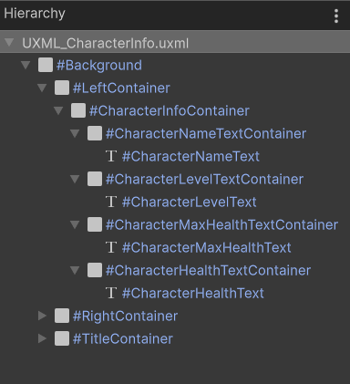

# [Unity] UI Toolkit New Features Tutorial | Part 2

---

## Intro

<details>
<summary>Tutorial Overview (Click to Expand / Collapse)</summary>

Yes, indeed!  
The UI Toolkit in Unity introduced some key new features after version 2023.2.  
This tutorial will cover the most significant improvements, including:

- New data binding methods
- Simplified custom control creation
- Usage methods for some new attributes

This tutorial will provide detailed explanations of these new features through practical examples.

---

- [Example project files download](https://www.patreon.com/posts/unity-ui-toolkit-102677647?utm_medium=clipboard_copy&utm_source=copyLink&utm_campaign=postshare_creator&utm_content=join_link)

---

- Tutorial recording live stream:

    - Day 1:
        - [Bilibili](https://www.bilibili.com/video/BV1Pt421j7DX/)
        - [Patreon](https://www.patreon.com/posts/unity-ui-toolkit-102799835?utm_medium=clipboard_copy&utm_source=copyLink&utm_campaign=postshare_creator&utm_content=join_link)
    - Day 2:
        - [Bilibili](https://www.bilibili.com/video/BV13t421A7y5/)
        - [Patreon](https://www.patreon.com/posts/unity-ui-toolkit-102845772?utm_medium=clipboard_copy&utm_source=copyLink&utm_campaign=postshare_creator&utm_content=join_link)

---

- Tutorial Videos：

    - Part 1
        - [YouTube](https://youtu.be/cbQJq_O3ZEo)
        - [Bilibili](https://www.bilibili.com/video/BV1Jr421g7Lr/)
    - Part 2
        - [YouTube](https://youtu.be/eBda493MQHo)
        - [Bilibili](https://www.bilibili.com/video/BV1WD421T7oq/)
    - Part 3
        - [YouTube](https://youtu.be/Z9AVTt4zZck)
        - [Bilibili](https://www.bilibili.com/video/BV1Ui421Q7HP/)

</details>

---

This tutorial consists of three parts, and this is the second part, focusing on:

- `[CreateProperty]` and `[DontCreateProperty]` attributes
- Declaring data bindings in UXML
- Performing dynamic data binding in C# scripts

---

## Binding Other UI Elements

In the previous tutorial, we learned how to bind data from Scriptable Objects using the UI Builder,  
and successfully bound the text property of the character name label.  
Next, let's bind the remaining UI elements.

First, observe the Hierarchy.



We can see that the root element of the Character Info Screen UI is this Background element, and all other UI elements are children of this background.  
Therefore, we can set the data source of this Background to our CharacterInfoData SO.  
This is because we want to leverage the data source's characteristic of propagating from parent to child elements.  
In other words, child elements will inherit the data source from their parent element until they override it with their own.  
All the data our UI needs comes from this CharacterInfoData SO, so we only need to set the data source of this background element to this SO.  
Right-click on the data source of the CharacterNameText label or click the options button next to it, and we choose to reset the data source of this label.  
Even if we don't set the data source for child elements, they will automatically inherit the data source set by the parent element.  
By using this feature effectively, we can reduce unnecessary operations and manage data more uniformly.

OK, let's bind the text property of the CharacterLevelText label to the `characterLevel` field in the SO.  
Here we encounter a problem: the result is not what we want.  
Currently, the text of the CharacterLevelText label only displays a number, which is the value of the `characterLevel` integer field.  
But what we want is not just a number, but a combination like "Level: number".  
We need to find a way to convert this integer value into such a formatted string.

The simplest way here is to use C# properties.

Back to the CharacterInfoData class.  
Let's write a string-type property named `CharacterLevelString`.  
Usually, all members of a class should be `private`, but if you need to access this property in other classes, you can make it `public`.  
We'll use string interpolation to assign a value to this property.  
In double quotes, we can input other characters in the format we need, and in curly braces, we pass in the `characterLevel` field, like this:

```C#
string CharacterLevelString => $"Level: {characterLevel}";
```

Now, the SO has a string that meets our requirements.  
However, the data source path cannot find the `CharacterLevelString` we just wrote.  
This is because this string is just a simple expression-bodied property, and UI Builder cannot find non-serialized properties.  

So, what should we do?

---

## [CreateProperty] Attribute

Actually, it's quite simple.  
We just need to add a `[CreateProperty]` attribute to this property.

```C#
using Unity.Properties;

[CreateProperty] string CharacterLevelString => $"Level: {characterLevel}";
```

Save the script, and you can see that this `CharacterLevelString` property appears in the data source path.  
We'll bind it to the text property of the CharacterLevelText label.  
The content of this label will become what we want.  
When we modify the value of `characterLevel` field in the SO, the UI in the Game View will also update in real-time.

Perfect!  
Here, we combine the use of C# properties and the `[CreateProperty]` attribute.  
Through this combination, we can obtain a property for UI data binding without changing the declared serialized fields.  
Serialized fields are responsible for exposure in the editor for easy assignment, while properties marked with `[CreateProperty]` are responsible for binding to UI elements.  
We also make use of the characteristics of C# properties to process the original data and convert it into the format we need.

I did similar operations for `characterName` and `characterMaxHealth`, declaring their respective string properties:

```C#
[CreateProperty] string CharacterNameString => $"Name: {characterName}";
[CreateProperty] string CharacterMaxHealthString => $"Max Health: {characterMaxHealth}";
```

Then I changed the data source path of the text property of the CharacterNameText label to `CharacterNameString`.  
This makes the character name display in the UI more complete.

---

## [DontCreateProperty] Attribute

Next, let's introduce another attribute: `[DontCreateProperty]`.  
As the name suggests, its purpose is not to create properties.  
The role of this attribute is opposite to that of the `[CreateProperty]` attribute.  
The `[CreateProperty]` attribute is used to mark members that cannot be serialized by Unity, allowing it to generate a serialized property.  
In contrast, the `[DontCreateProperty]` attribute is used to mark members that can be serialized by Unity, such as `public` fields or `private` fields marked with `[SerializeField]`, preventing them from creating serialized properties.  
Yes, like the four serialized fields we wrote in the CharacterInfoData class.  
Now, we can find these four serialized fields in the data source path.  
But actually, we don't want to bind these four fields because they don't meet our requirements.  
Therefore, we can add the `[DontCreateProperty]` attribute to these four serialized fields to prevent them from creating serialized properties.

```C#
using Unity.Properties;
using UnityEngine;

[DontCreateProperty, SerializeField] string characterName;
[DontCreateProperty, SerializeField] int characterLevel;
[DontCreateProperty, SerializeField] int characterMaxHealth; 
[DontCreateProperty, SerializeField] int characterHealth;
```

This way, they will no longer appear in the data source path.  
By using this attribute properly, we can prevent UI designers who are not involved in programming or developers themselves from binding incorrect data.
Please use it wisely.

---

## Declaring Data Bindings in UXML

Next, let's bind the text property of the CharacterMaxHealthText label.  
We will demonstrate another way of data binding:  
Directly binding the text property of the CharacterMaxHealthText label to the `CharacterMaxHealthString` property in the SO in UXML.

Click the button under the UI Builder viewport to open the UXML file in the IDE.  
By the way, the button on the other side opens the currently active USS file.


In the new version of UXML, developers can directly add `<Bindings>` declarations in the code to add data bindings to UI elements.  
Observing the two labels that have been added data-bindings in the UI Builder before, we can see that they already have this code block.  
We find the element of the CharacterMaxHealthText label and add a binding declaration to it by coping these code.

The only thing we need to change in this declaration is the data source path.  
We change it to `CharacterMaxHealthString`.  
Regarding the binding mode here, we will explain it in detail in the last remaining method of data binding.  
Here, we keep the default `ToTarget` mode.

```uxml

<engine:Label text="Max Health: ???" name="CharacterMaxHealthText" class="text character-info-text">
    <Bindings>
        <engine:DataBinding property="text" binding-mode="ToTarget" data-source-path="CharacterMaxHealthString" />
    </Bindings>
</engine:Label>
```
This code can be understood as:  
Establish a data binding relationship from `CharacterMaxHealthString` to the text property of the CharacterMaxHealthText label.  
When the value of `CharacterMaxHealthString` changes, the value of the text property of this label will also automatically update.

OK, let's save the UXML and return to the UI Builder.  
You can see that the text property of the CharacterMaxHealthText label has been bound, and the UI in the viewport has also been updated to the value of the `CharacterMaxHealthString` property in the SO.  
When we edit the data in the SO, the UI in the Game View will also automatically update accordingly.  
This shows that the binding we added in UXML is effective.

This is how to add bindings through UXML.  
In fact, this method has the same effect as adding bindings in the UI Builder.  
In the end, both methods write data binding-related code in UXML.  
The difference lies in that the UI Builder provides a visual way to edit UXML.  
Therefore, if you don't have knowledge of markup languages, using the UI Builder to add bindings is sufficient.

---

## Performing Dynamic Data Binding in C# Scripts

We still have one last label, the CharacterHealthText label, that hasn't been bound to data.  
Next, we will use the final new method of data binding, which is to dynamically add its binding through C# code.

First, we prepare the data source.  
We add a property named `CharacterHealthString` in the CharacterInfoData class.  
Its value is written like this:

```C#
[CreateProperty] public string CharacterHealthString => $"Health: {characterHealth} / {characterMaxHealth}";
```

By connecting the current health and maximum health of the character with `/`, this format will better match the typical display style of a character's current health in games.  
Since we need to access this property in another class, we mark it as `public`.

OK, next, we create a C# script named CharacterInfoUI.  
Attach this script to the Sample UI game object.

This is a MonoBehaviour, through which we can obtain the UI element we need to bind and dynamically add data bindings to that element.

In the OnEnable() function of this class, first, we use UQuery to get the CharacterHealthText label we need.

```C#
using UnityEngine;
using UnityEngine.UIElements;

public class CharacterInfoUI : MonoBehaviour
{
    void OnEnable()
    {
        VisualElement root = GetComponent<UIDocument>().rootVisualElement;
        Label characterHealthLabel = root.Q<Label>("CharacterHealthText");
    }
}
```

I won't explain UQuery here.  
I have provided very detailed explanations in my previous tutorial videos.  
If you don't have this knowledge, please refer to the tutorial videos I made.

<details>
<summary>UI Toolkit UQuery Tutorial (Click to Expand / Collapse)</summary>

    - [YouTube](https://youtu.be/DOn8P5Fg0gg)
    - [Bilibili](https://www.bilibili.com/video/BV1tG4y147ha/)

</details>

Then, we call the `SetBinding()` method of this label to set its binding.  
This is a new API added after version 2023.2.  
It requires two parameters:

- The first parameter is a `UIElements.BindingId` class, which is the ID of the property of the UI element we need to bind.  
  Here, we need to bind the text property of the CharacterHealthText label.  
  We can directly pass a `"text"` string, and it will automatically be converted into the ID of the text property of that label.  
  But all along, I personally don't like to use string parameters very much, so here I generally use the `nameof()` method to get this ID.
- The second parameter is a `UIElements.Binding` class, used to pass specific information about the data binding.  
  For this parameter, we can create a `DataBinding` class, which inherits from `UIElements.Binding`.  
  In the object initializer of this parameter, we assign values to several key properties:
    - `dataSource`: We can declare and use a serialized CharacterInfoData class field.
    - `dataSourcePath`: What we want to pass in is the `CharacterHealthString` property in the SO.  
      Here, we directly create a corresponding `PropertyPath` class.  
      Its constructor parameter needs to pass a `string` type property path, and we also use the `nameof()` method to obtain the property path of the `CharacterHealthString` property.
    - `bindingMode`: This is a `BindingMode` enum class, which has four types:
        - `TwoWay`: Two-way binding.  
          When the property value of the bound UI element changes, the source data will be updated accordingly;  
          when the value of the source data changes, the property value of the bound UI element will also change accordingly.  
          This binding mode is suitable for some situations, such as "respec".  
          When a player respecs, the UI and the player's attribute data should be synchronized.
        - `ToSource`: Bind to the data source.  
          When the property value of the bound UI element changes, the value of the data source will be updated accordingly.  
          Conversely, when the source data changes, the UI will not be updated.  
          For example, the volume slider in the game settings screen.  
          We only want to change the volume by dragging the slider, without affecting the UI in return.
        - `ToTarget`: Bind to the target property of the UI element.  
          The UI only updates when the property value of the data source changes.  
          In most cases, the UI responds to changes in game data.  
          Therefore, this is the most commonly used binding mode for us.
        - `ToTargetOnce`: Similarly, bind to the target property of the UI element, but the UI will only update once, and the UI will not update when the source data changes next time.  
          This binding mode is used in some specific situations, such as the player's achievement UI.  
          After the player achieves a certain achievement, the UI only needs to be updated once, and we don't need to care about subsequent changes in the source data.

      For the `bindingMode` parameter here, we pass in `BindingMode.ToTarget`, and you can choose other modes according to your actual needs in practice.

```C#
using Unity.Properties;
using UnityEngine;
using UnityEngine.UIElements;

public class CharacterInfoUI : MonoBehaviour
{
    [SerializeField] CharacterInfoData characterInfoData;
    
    void OnEnable()
    {
        VisualElement root = GetComponent<UIDocument>().rootVisualElement;
        Label characterHealthLabel = root.Q<Label>("CharacterHealthText");
        
        characterHealthLabel.SetBinding(nameof(characterHealthLabel.text), new DataBinding
        {
            dataSource = characterInfoData,
            dataSourcePath = new PropertyPath(nameof(characterInfoData.CharacterHealthString)),
            bindingMode = BindingMode.ToTarget
        });
    }
}
```

OK, now we have set up the data binding for the text property of the CharacterHealthText label.

Here are the documentation links for the APIs used above. If you need them, please go and check them out for learning.

<details>
<summary> APIs about SetBinding() (Click to Expand / Collapse)</summary>

- [VisualElement.SetBinding](https://docs.unity3d.com/2023.2/Documentation/ScriptReference/UIElements.VisualElement.SetBinding.html)
- [BindingId](https://docs.unity3d.com/2023.2/Documentation/ScriptReference/UIElements.BindingId.html)
- [DataBinding](https://docs.unity3d.com/2023.2/Documentation/ScriptReference/UIElements.DataBinding.html)
- [PropertyPath](https://docs.unity3d.com/2023.2/Documentation/ScriptReference/Unity.Properties.PropertyPath.html)
- [BindingMode](https://docs.unity3d.com/2023.2/Documentation/ScriptReference/UIElements.BindingMode.html)

</details>

`VisualElement.SetBinging()` provides a way to dynamically perform UI data binding, which provides developers with more flexibility and control.  
However, since it is dynamic, the binding will only take effect after the game is running.

To facilitate observing the changes in the UI, I wrote a `public` property for the `characterHealth` field in the CharacterInfoData class like this:

```C#
public class CharacterInfoData : ScriptableObject
{
    public int CharacterHealth
    {
        get => characterHealth;
        set
        {
            if (characterHealth == value) return;
            characterHealth = Mathf.Clamp(value, 0, characterMaxHealth);
        }
    }
}
```

Then, in the `Update()` of CharacterInfoUI, I wrote some Debug code to simulate the change in the character's health:

```C#
public class CharacterInfoUI : MonoBehaviour
{
    [SerializeField] CharacterInfoData characterInfoData;
    
    // For UI Debug
    void Update()
    {
        if (Input.GetKey(KeyCode.Q))
        {
            characterInfoData.CharacterHealth--;
        }
    
        if (Input.GetKey(KeyCode.E))
        {
            characterInfoData.CharacterHealth++;
        }
    }
}
```

Save the script and return to the Unity editor.  
Fill in the SO filed in the CharacterInfoUI script, and run the game.  
When we press the Q key on the keyboard, we can observe that the character's health will decrease continuously until it reaches 0.  
When the E key is pressed, the character's health will increase continuously until it reaches the maximum health.  
Great! The data binding we performed in C# code also works correctly.

---

## Outro

This concludes Part 2 of the tutorial.  
We have also finished introducing the new data binding methods added to UI Toolkit.  
As for which method to choose for data binding during development, it depends on your actual needs.

In the next part of the tutorial, we will continue to learn about the new way of creating custom controls and summarize and apply all the knowledge we have learned before.

I hope this tutorial is helpful to you.  
Thank you for reading.
See you next time.

---

RYan Xu 2024-04-28