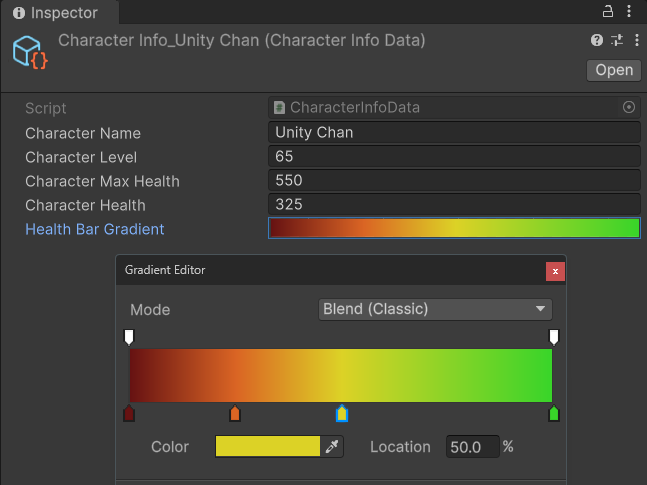

# [Unity] UI Toolkit New Features Tutorial | Part 3

---

## Intro

<details>
<summary>Tutorial Overview (Click to Expand / Collapse)</summary>

Yes, indeed!  
The UI Toolkit in Unity introduced some key new features after version 2023.2.  
This tutorial will cover the most significant improvements, including:

- New data binding methods
- Simplified custom control creation
- Usage methods for some new attributes

This tutorial will provide detailed explanations of these new features through practical examples.

---

- [Example project files download](https://www.patreon.com/posts/unity-ui-toolkit-102677647?utm_medium=clipboard_copy&utm_source=copyLink&utm_campaign=postshare_creator&utm_content=join_link)

---

- Tutorial recording live stream:

    - Day 1:
        - [Patreon](https://www.patreon.com/posts/unity-ui-toolkit-102799835?utm_medium=clipboard_copy&utm_source=copyLink&utm_campaign=postshare_creator&utm_content=join_link)
        - [Bilibili](https://www.bilibili.com/video/BV1Pt421j7DX/)
    - Day 2:
        - [Patreon](https://www.patreon.com/posts/unity-ui-toolkit-102845772?utm_medium=clipboard_copy&utm_source=copyLink&utm_campaign=postshare_creator&utm_content=join_link)
        - [Bilibili](https://www.bilibili.com/video/BV13t421A7y5/)

---

- Tutorial Videos：

    - Part 1
        - [YouTube](https://youtu.be/cbQJq_O3ZEo)
        - [Bilibili](https://www.bilibili.com/video/BV1Jr421g7Lr/)
    - Part 2
        - [YouTube](https://youtu.be/eBda493MQHo)
        - [Bilibili](https://www.bilibili.com/video/BV1WD421T7oq/)
    - Part 3
        - [YouTube](https://youtu.be/Z9AVTt4zZck)
        - [Bilibili](https://www.bilibili.com/video/BV1Ui421Q7HP/)

</details>

---

This tutorial consists of three parts, and this is the third part, focusing on:

- New method to create custom controls
- New attribute declaration method for custom controls
- Tutorial summary and practical application

---

## Simplified Method for Creating Custom Controls

Let's start by introducing the new method for creating custom controls in UI Toolkit.

Our character information screen UI still lacks some graphical elements.  
We'll add a health bar to dynamically and intuitively display the character's health.

For a quick implementation, we could use the built-in progress bar element.  
However, its effect isn't optimal and isn't suitable for further functionality expansion.  
Therefore, we'll create our own health bar.

This will be a custom control named HealthBar, which inherits from VisualElement, the base class for all UI Toolkit elements.

```csharp
public class HealthBar : VisualElement 
{
    public HealthBar() {}
}
```

In the old version, we needed to declare a nested UxmlFactory class within this class, which wasn't very intuitive:

```csharp
public new class UxmlFactory : UxmlFactory<HealthBar> {} 
```

In the new version, we don't do this.  
We simply add a new attribute to this class: [UxmlElement], and mark it as partial.

```csharp
[UxmlElement]
public partial class HealthBar : VisualElement
{
    public HealthBar() {}
}
```

The `[UxmlElement]` attribute marks the class as a UI element usable in UXML files and UI Builder.  
This attribute, combined with `partial` keyword, automatically generates the additional code needed to expose the class to the UI builder.  
This simplification makes our code cleaner and easier to understand.

Let's save the script and back to the UI Builder.  
You can find our HealthBar custom control under Library - Project - Custom Controls.  
First, drag a Visual Element under the CharacterInfoContainer as the container for the health bar.  
Then, drag a Health Bar control under this container.  
Currently, this control is empty because we haven't built anything for it yet.

---

## Building the Character Health Bar UI Control

OK, back to the HealthBar script.  
In the constructor of this class, let's start by adding some elements to it.

Firstly, we need a background element for the health bar and a foreground element to represent the fill value of the health bar.  
Let's create them and set their names, which are their IDs.

We'll add the background element to the control by calling the control's Add method.  
Since the control is initially empty, the first added background element will become its root element.

Then, we'll add the foreground element to the background element.  
Since they are stacked on top of each other, the later-added foreground element will overlay the background element during rendering.  
This way, when the size of the background element doesn't change, we can achieve the filling effect by changing the width of the foreground element.

```csharp
readonly VisualElement background;
readonly VisualElement foreground;

public HealthBar() 
{
    background = new VisualElement();
    foreground = new VisualElement();

    background.name = "Background";
    foreground.name = "Foreground";
    
    // The width of the foreground will dynamically change with character's health, so we can't set it fixed. 
    // However, the height of the foreground can be set relative to its parent, the background element's height, which is 100%.
    foreground.style.height = new StyleLength(new Length(100, LengthUnit.Percent));
    
    Add(background);
    background.Add(foreground);
}
```

Back to the UI Builder, you can now see Background and Foreground elements under Health Bar.  
Currently, their styles are default, with heights and widths set to 0, so there's nothing rendered.  
I defined the style of the health bar through USS selectors to render it as desired.  
If you need to learn more about USS selectors, I've previously provided detailed explanations in tutorial videos.

<details>
<summary>USS Selector Tutorial (Click to Expand / Collapse)</summary>

- [YouTube](https://youtu.be/zkecVznjBeY)
- [Bilibili](https://www.bilibili.com/video/BV11M411y7Vs/)

</details>

Note that the width and height units of the Foreground element are percentages.  
So, they are calculated relative to its parent, the Background element's width and height, respectively.  
When we modify the width percentage of the foreground element, it will fill the background element accordingly. 

Next is the logical part of the UI.  
The most important function of this UI is to visually display the percentage of the character's health.  
When the character's health changes, we want the fill value of the health bar to update accordingly.

Here, we need an integer variable to represent the percentage of the foreground element's width, which is the fill value of the health bar.  
Let's call this variable `fillPercent`, with a default value of 50, representing half of the fill value. 

```csharp
int fillPercent = 50;
```

We also need to declare a property exposed to the UI builder for data binding.  
Let's name it `FillPercent`.  
Its getter returns the value of `fillPercent`, and its setter sets the value of `fillPercent`.  
Additionally, when the `fillPercent` variable changes, we'll set the width percentage of the foreground element to the value of the `fillPercent`.

```csharp
int FillPercent
{
    get => fillPercent;
    set
    {
        if (fillPercent == value) return;
        fillPercent = value;
        foreground.style.width = new StyleLength(new Length(fillPercent, LengthUnit.Percent));
    }
}
```

---

## [UxmlAttribute] Attribute

Next, let's expose this property to the UI builder.

In the old version of UI Toolkit, to declare attributes exposed to the editor for custom controls, we needed to write a lot of code related to `UxmlTraits`.  
This process has been greatly simplified in the new version.  
We only need to use the `[UxmlAttribute]` attribute to mark the `FillPercent` property.  
This attribute functions similarly to `[SerializeField]`, exposing the marked property to the editor.  
However, it cannot serialize the property, and it only affects properties within VisualElement.

There's one small detail.  
Clearly, `FillPercent`'s values will be between 0 and 100, not exceeding this range.  
Therefore, we can use the `[Range]` attribute to limit its value range.

```csharp
const float BorderRaidus = 5;
const float BorderRaidusThreshold = 98;

[UxmlAttribute, Range(0, 100)]
int FillPercent
{
    get => fillPercent;
    set
    {
        if (fillPercent == value) return;
        fillPercent = value;
        foreground.style.width = new StyleLength(new Length(fillPercent, LengthUnit.Percent));
        // When the background's borderRadius is not 0 (as in the example, it's 5 pixels),
        // if fillPercent exceeds a certain threshold (BorderRaidusThreshold), 
        // we must also apply the same borderRadius to the right half of foreground.
        // Otherwise, the square rendered by foreground will cover background, which isn't aesthetically pleasing.
        foreground.style.borderTopRightRadius = new StyleLength(fillPercent >= BorderRaidusThreshold ? BorderRaidus : 0);
        foreground.style.borderBottomRightRadius = new StyleLength(fillPercent >= BorderRaidusThreshold ? BorderRaidus : 0);
    }
}
```

Save the script and return to the UI Builder.  
The HealthBar custom control's attributes menu now includes the Fill Percent attribute we declared.  
In the editor, it displays as a slider ranging from 0 to 100, thanks to the Range attribute we added.  
When we drag this slider, we can see the width of the foreground element changing accordingly.


Next, we just need to bind this Fill Percent attribute to the data.  
However, unlike other properties, when we right-click on this Fill Percent attribute or click on the options button next to it, we can't find an option to add bindings.  
Why is that?

The reason is simple.  
As mentioned earlier when discussing data binding, this `FillPercent` property is just a regular C# property.  
Although we exposed it to the editor by adding the `[UxmlAttribute]` attribute, the UI Builder doesn't recognize it as a serializable property suitable for data binding.  
So, how do we bind data to it?  
Simply by adding the `[CreateProperty]` attribute to it.  
Now, when we right-click on this Fill Percent attribute or click on the three-dot option button next to it, we see the "Add Binding..." option, and we can add data bindings to it.

As for the data source, we need the percentage value of the character's current health.  
Let's declare a float property named `HealthPercent` in the CharacterInfoData class, with its value being the `characterHealth` divided by the `characterMaxHealth`.

```csharp
float HealthPercent => (float)characterHealth / characterMaxHealth;
```

Of course, this property returns a decimal number between 0 and 1.  
Therefore, let's declare another `[CreateProperty]` integer property used to bound to the UI, named `HealthPercentInt`.  
This property rounds the `HealthPercent` to the nearest integer between 0 and 100.

```csharp
[CreateProperty]
int HealthPercentInt => Mathf.RoundToInt(HealthPercent * 100);
```

Let's declare another `[CreateProperty]` string property, named `HealthPercentString`.  
This property converts `HealthPercent` into a percentage format string without decimal points.

```csharp
[CreateProperty]
string HealthPercentString => HealthPercent.ToString("P0", System.Globalization.CultureInfo.InvariantCulture);
```

Once again, this demonstrates the advantage of C# properties.  
By declaring different types of properties for the same data, we can obtain different versions of data output to meet various practical usage needs.

Back in the UI Builder. 
let's bind `FillPercent` to `HealthPercentInt` from the data source.  
We also added a label to display the character's current health percentage, and bind `HealthPercentString` to the text property of this label.  
Now, when we modify the `characterHealth` in the SO, we can see both the fill value and the text of the health bar updating accordingly.  
When the game is running, we can simulate changes in the character's health using the Q and E keys, and similarly, the health bar UI will update accordingly.

---

## Summary

That's the key new features of the new version of UI Toolkit.

Through this simple example of a character info screen UI, we've detailed various aspects of the major new features added.  
The most significant change is the addition of data binding, which decouples the UI from the data in a new way, resolving previously challenging issues.  
The next significant change is the simplified method for creating custom controls and the use of new attributes.  
These new features make UI Toolkit more intuitive and user-friendly, providing developers with more convenience and flexibility.

It's not an exaggeration to say that in some projects, UI Toolkit can already replace most of the functionality of UGUI.  
Personally, I've thoroughly refactored my previous side-scrolling shooter game tutorial project using UI Toolkit, and achieved excellent results. 

- [My side-scrolling shooter game tutorial project - Shooting Star (WebGL Version)](https://ryanxudev.github.io/#game-shooting-star)

I believe that in the near future, as rendering and other functionalities of UI Toolkit improve, it will play an even more important role.

---

## Practice

After learning so much, I'd like to leave you with a small challenge.  
Please use the new knowledge you've gained to implement a feature:  
the fill color ( the background-color of foreground element ) of the health bar changes along with the character's health.

This is a very common UI feature in modern games.  
Typically, when the character is healthy, the health bar is green, and when the character is close to death, the color changes to dark red.

Try to think about and implement it!

<details>
<summary>My Implementation (Click to Expand / Collapse)</summary>

Back in the HealthBar custom control script.  
To set the color of the foreground element, we clearly need to declare a Color field.  
Let's call it `foregroundColor`.

```csharp
Color foregroundColor;
```

We also need a color property marked as `[CreateProperty]` and `[UxmlAttribute]` for data binding and exposure to the editor.  
Let's call it `ForegroundColor`.  
When the value of the `foregroundColor` field changes, we'll simultaneously modify the background color of the foreground element by assigning the value of `foregroundColor` field to it.

```csharp
[CreateProperty, UxmlAttribute]
Color ForegroundColor
{
    get => foregroundColor;
    set
    {
        if (foregroundColor == value) return;
        foregroundColor = value;
        foreground.style.backgroundColor = new StyleColor(foregroundColor);
    }
}
```

Back in the UI Builder, the Health Bar control now has a bindable Foreground Color attribute.

Next is the data source.  
Back in the CharacterInfoData class, we need a color that changes along with the percentage value.  
Fortunately, Unity has a class that fits our needs perfectly: `Gradient`.  
Let's declare a serialized Gradient field named `healthBarGradient`.

```csharp
[DontCreateProperty, SerializeField]
Gradient healthBarGradient;
```

Then, let's declare a `Color` property for UI data binding, let's call it `HealthBarColor`.
For this property's value, we'll use the `Evaluate()` method of `healthBarGradient`.  
This method requires a normalized float parameter between 0 and 1, and based on this parameter, returns one of the colors from the gradient color ramp.  
Here, we'll pass in the `HealthPercent` property as this parameter.  
This way, we can get a color based on the current health percentage of the character.

```csharp
[CreateProperty]
Color HealthBarColor => healthBarGradient.Evaluate(HealthPercent);
```

Back to the Unity editor.  
Let's set up the gradient colors in the CharacterInfoData SO.  
We'll set dark red for the value of 0 on the left and green for the value of 1 on the right.  
Feel free to add other colors in between, like yellow around 50% and orange around 25%.



Then, in the UI Builder, let's bind the background color property of the foreground element to the `HealthBarColor` property in the data source.

All done!  
Now, when the character's health changes, we can see the health bar's color transitioning perfectly.

</details>

Finally, let me leave you with a small assignment:  
Please bind data to the portrait element.

This should be straightforward by now.  
You've learned enough, right?

---

## Conclusion

That concludes this tutorial.  
Thank you for your continued support and encouragement.  
I hope this tutorial has been helpful to you!  
Please share it with more people so that everyone can see it.

Thank you for reading.  
See you next time!

---

RYan Xu 2024-05-07
