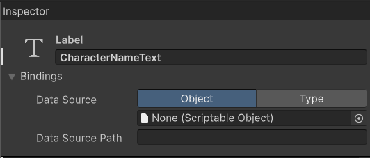

# [Unity] UI 工具包 新功能教程 | 第一部分

---

## 引言

<details>
<summary>教程简介（点击展开 / 隐藏）</summary>

Yes, indeed!  
Unity的UI工具包 (UI Toolkit) 在2023.2版本之后引入了一些关键的新功能。  
本教程将涵盖其中最主要的改进内容，包括：

- 新的数据绑定 (Data Binding) 方式
- 简化的自定义控件 (Custom Control) 创建方式
- 一些新特性 (Attribute) 的使用方法

本教程将结合实际案例来详细的讲解这些新的功能。

---

- 示例工程文件下载：

    - [Patreon](https://www.patreon.com/posts/unity-ui-toolkit-102677647?utm_medium=clipboard_copy&utm_source=copyLink&utm_campaign=postshare_creator&utm_content=join_link)
    - [爱发电](https://afdian.net/p/379c052cfe9311ee8c5652540025c377)

---

- 教程录制直播录像：

    - Day 1:
        - [Bilibili](https://www.bilibili.com/video/BV1Pt421j7DX/)
        - [Patreon](https://www.patreon.com/posts/unity-ui-toolkit-102799835?utm_medium=clipboard_copy&utm_source=copyLink&utm_campaign=postshare_creator&utm_content=join_link)
        - [爱发电](https://afdian.net/p/8283596c00d911ef81a15254001e7c00)
    - Day 2:
        - [Bilibili](https://www.bilibili.com/video/BV13t421A7y5/)
        - [Patreon](https://www.patreon.com/posts/unity-ui-toolkit-102845772?utm_medium=clipboard_copy&utm_source=copyLink&utm_campaign=postshare_creator&utm_content=join_link)
        - [爱发电](https://afdian.net/p/e649e94400dd11efa59e52540025c377)

---

- 视频教程：

    - Part 1
        - [YouTube](https://youtu.be/cbQJq_O3ZEo)
        - [Bilibili](https://www.bilibili.com/video/BV1Jr421g7Lr/)
    - Part 2
        - [YouTube](https://youtu.be/eBda493MQHo)
        - [Bilibili](https://www.bilibili.com/video/BV1WD421T7oq/)
    - Part 3
        - [YouTube](https://youtu.be/Z9AVTt4zZck)
        - [Bilibili](https://www.bilibili.com/video/BV1Ui421Q7HP/)

</details>

---

本教程由三个部分组成，这是第一部分，主要内容是：

- 示例工程的准备
- 新的数据绑定方式的其中之一：通过 UI 构建器绑定 SO

---

## 示例工程准备

先说一下示例工程的引擎版本。  
我使用的是最新发布版的 Unity 编辑器。  
如开头所说，UI 工具包的新功能是在2023.2版本之后才加入的。  
因此，如果你想跟着一起做的话，请记得使用最新发布版本的 Unity 编辑器。

首先，我制作了一个UXML，这是个简单的角色信息 (Character Info) 画面。


UI 的构建过程我就不解释了，我在以前的视频教程中有过详细的讲解。  
如果你需要从头学习如何通过 UI 构建器来创建 UI，可以参考我以前的视频教程。

<details>
<summary>UI Toolkit 基础教程（点击展开 / 隐藏）</summary>

- [YouTube](https://www.youtube.com/playlist?list=PLrn_k3ArwNC1l_upOeWPdfRyLcXBuE-tx)
- [Bilibili](https://www.bilibili.com/video/BV1pK411m7n9/)

</details>

我在示例场景中创建了一个带有 UI Document 组件的游戏对象(在 Hierarchy 里右键 - UI Toolkit - UI Document)，将它命名为 Sample UI。  
UI Document 组件的 Source Asset 我们选择刚才创建的角色信息画面Uxml文件，这样游戏窗口就会显示该UI了。


然后，我写了一个C#类，名为CharacterInfoData，角色信息数据类。

```C#
using UnityEngine;

[CreateAssetMenu(fileName = "CharacterInfo_", menuName = "Data/Character Info")]
public class CharacterInfoData : ScriptableObject
{
    [SerializeField] string characterName;

    [SerializeField, Min(0)] int characterLevel;

    [SerializeField, Min(0)] int characterMaxHealth;

    [SerializeField, Min(0)] int characterHealth;
}
```

这是个可编程对象 (Scriptable Object)，也就是我们常说的SO。  
这个类用来模拟游戏中的玩家属性数据，同样的它也非常的简单。  
它持有：  
角色的名字 (characterName)  
角色的等级 (characterLevel)  
角色的最大生命值 (characterMaxHealth)  
角色的当前生命值 (characterHealth)  
这四个字段。  
对应的是我们的角色信息画面所需要绑定的四个 UI 元素。  
这里，我将这四个私有字段标记为`[SerializeField]` ，将它们序列化。  
序列化字段的好处之一是我们可以在编辑器里直接为它们赋值。

之后，我在编辑器里创建了这个类的SO资产文件。


这样我们的初始项目就准备好了。

---

## 新的数据绑定方式

在新的版本中，开发者现在可以更灵活地进行数据绑定。  
这一功能极大地简化了 UI 数据绑定的流程。  
新的数据绑定主要有三种方式：

1. 在 UI 构建器里直接添加数据来源并绑定数据
2. 在 UXML 里添加数据绑定的相应内容
3. 在 C# 脚本里调用 VisualElement.SetBinding() 方法为 UI 元素设置绑定

---

## 在 UI 构建器里绑定 SO

在新版本的 UI Builder 里，当我们点击一个 UI 元素时，可以在观察器 (Inspector) 的最上面找到一个 Bindings 选项。  
我们以角色信息画面的玩家名字文本标签 (CharacterNameText, 这是个 Label) 为例:



这里我们可以设置该 UI 元素的数据来源 (Data Source)。  
我们可以选择使用 SO，或者使用一个类 (Type)。  
这里我们使用刚才创建的角色信息数据类 SO。  
然后我们鼠标右键点击这个标签的 Text 属性，可以发现一个新增加的 “Add Binding...” 选项。  
点击它，可以打开这个属性的添加绑定窗口。  

可以看到这个窗口里的数据来源已经自动添加好了我们刚才选择的角色信息数据SO。  
我们也可以选择其他的数据来源，从而实现原有数据来源的 Overriding。  
当数据来源不为空时，点击数据来源路径 (Data Source Path)，我们就可以选择数据来源里的一个属性做为这个文本属性的数据来源路径了。  
这里我们选择 `characterName` 这个字符串类型的序列化字段。  
最后，点击右下角的 "Add Binding" 按钮。  


这样，我们就完成了角色名字标签的 Text 属性和 SO 里的 `characterName` 属性的绑定。  
可以看到该文本属性的内容以及视口 (Viewport) 里的角色名字都已经变成了 SO 里 `characterName` 这个字段的值。  
保存 UXML 回到编辑器，游戏窗口里的 UI 也更新了。  

比较神奇的是，当我们在编辑器里修改 SO 里的 `characterName` 的值时， 即使不运行游戏，游戏画面里的 UI 也会实时更新。  
而如果我们绑定的是一个类，那么就必须在游戏运行时这个被绑定的类里的数据发生变动时才能观察到 UI 的变化。  
相对于绑定一个类，这是绑定 SO 所带来的其中一个优势。  
不管是对程序员还是不参与编程的设计师来说，这都是很有用的。  
因此，个人更推荐通过绑定 SO 的方式来实现 UI 的数据绑定。

---

## 结语

本教程第一部分的内容到这里就结束了。  
下一部分我们将学习几个新的特性以及另外两种数据绑定方式。  

感谢您的阅读。  
我们下次见。

---

阿严 2024-04-19
