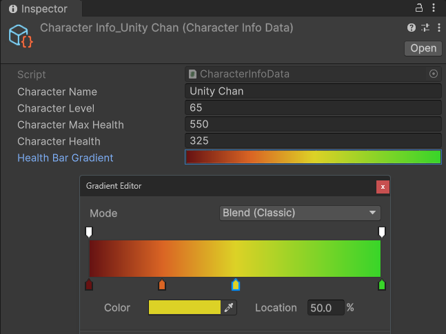

# [Unity] UI 工具包 新功能教程 | 第三部分

---

## 引言

<details>
<summary>教程简介（点击展开 / 隐藏）</summary>

Yes, indeed!  
Unity的UI工具包 (UI Toolkit) 在2023.2版本之后引入了一些关键的新功能。  
本教程将涵盖其中最主要的改进内容，包括：

- 新的数据绑定 (Data Binding) 方式
- 简化的自定义控件 (Custom Control) 创建方式
- 一些新特性 (Attribute) 的使用方法

本教程将结合实际案例来详细的讲解这些新的功能。

---

- 示例工程文件下载：

    - [Patreon](https://www.patreon.com/posts/unity-ui-toolkit-102677647?utm_medium=clipboard_copy&utm_source=copyLink&utm_campaign=postshare_creator&utm_content=join_link)
    - [爱发电](https://afdian.net/p/379c052cfe9311ee8c5652540025c377)

---

- 教程录制直播录像：

    - Day 1:
        - [Bilibili](https://www.bilibili.com/video/BV1Pt421j7DX/)
        - [Patreon](https://www.patreon.com/posts/unity-ui-toolkit-102799835?utm_medium=clipboard_copy&utm_source=copyLink&utm_campaign=postshare_creator&utm_content=join_link)
        - [爱发电](https://afdian.net/p/8283596c00d911ef81a15254001e7c00)
    - Day 2:
        - [Bilibili](https://www.bilibili.com/video/BV13t421A7y5/)
        - [Patreon](https://www.patreon.com/posts/unity-ui-toolkit-102845772?utm_medium=clipboard_copy&utm_source=copyLink&utm_campaign=postshare_creator&utm_content=join_link)
        - [爱发电](https://afdian.net/p/e649e94400dd11efa59e52540025c377)

---

- 视频教程：

    - Part 1
        - [YouTube](https://youtu.be/cbQJq_O3ZEo)
        - [Bilibili](https://www.bilibili.com/video/BV1Jr421g7Lr/)
    - Part 2
        - [YouTube](https://youtu.be/eBda493MQHo)
        - [Bilibili](https://www.bilibili.com/video/BV1WD421T7oq/)
    - Part 3
        - [YouTube](https://youtu.be/Z9AVTt4zZck)
        - [Bilibili](https://www.bilibili.com/video/BV1Ui421Q7HP/)

</details>

---

本教程由三个部分组成，这是第三部分。主要内容是：

- 新的自定义控件的创建方法
- 新的自定义控件的属性声明方法
- 教程总结与实际应用

---

## 简化的自定义控件创建方法

我们先来介绍 UI Toolkit 新的自定义控件 (Custom Control) 创建方法。

我们的角色信息画面现在还缺少一些更图形化的元素。  
我们将为它添加一个血条，来更动态且直观的显示角色的生命值。  

快速实现的话，我们可以使用自带的进度条 (Progress Bar) 元素。  
但它的效果并不好，也不适合进一步的功能拓展。  
因此，我们将创建自己的血条。

这将是个名为 HealthBar 的自定义控件。  
和以前类似，它继承自 VisualElement，这是所有 UI Toolkit 元素的基类。

```csharp
public class HealthBar : VisualElement 
{
    public HealthBar() {}
}
```

在旧版本中，我们需要在这个类里面再声明一个不太好理解的 UxmlFactory 嵌套类：

```csharp
public new class UxmlFactory : UxmlFactory<HealthBar> {} 
```

从而将这个 VisualElement 曝露到 UI 构建器里，让它可以做为自定义控件使用。

而在新版本中，我们不这么做，只需要为这个类添加一个新的特性：`[UxmlElement]`, 并且将它标记为`partial`就可以了。  

```csharp
[UxmlElement]
public partial class HealthBar : VisualElement
{
    public HealthBar() {}
}
```

`[UxmlElement]`特性如它的字面意思，它会将这个类标记为 UXML 文件可以使用的 UI 元素。  
这个特性配合`partial`关键字，引擎会自动的为这个类生成曝露到 UI 构建器所需要的另一部分代码。  
这个简化让我们的代码变得更简洁且容易理解。

我们保存脚本回到 UI 构建器，可以在 Library - Project - Custom Controls 里找到我们的 Health Bar 自定义控件了。  
我们先拖一个 Visual Element 到角色信息容器底下做为血条的容器，然后再拖一个 Health Bar 控件到这个容器底下。  
当然，现在这个控件空空如也，因为我们还没有为它构建任何东西呢。

---

## 构建角色血条 UI 控件

OK，回到 HealthBar 脚本。  
在这个类的构造函数中，我们先来为它添加一些元素。

首先，我们需要一个血条的背景元素 (Background)，然后还需要一个用来表示血条填充值的前景元素 (Foreground)。  
先将它们 new 出来， 然后分别设置好这两个元素的名字，也就是它们的 ID。  

我们通过调用控件自身的 Add 方法将背景元素添加到控件里。  
这时候这个控件还什么都没有，因此第一个添加的背景元素将会成为它的根元素。

然后，我们调用背景元素的 Add 方法，将前景元素添加到它底下。  
由于它们是互相叠加的关系，后添加的前景元素在渲染时将会覆盖背景元素。  
这样，当背景元素的尺寸不改变时，我们就可以通过改变前景元素的宽度，来达到血条填充的效果。

```csharp
readonly VisualElement background;
readonly VisualElement foreground;

public HealthBar() 
{
    background = new VisualElement();
    foreground = new VisualElement();

    background.name = "Background";
    foreground.name = "Foreground";
    
    // foreground 的 width 将会随着 fillPercent 动态变动，因此我们不能将它写死。
    // 但是，foreground 元素的 height 则可以按它的父级元素，也就是 background 元素 height 的 100% 来设置。
    // 当这里的 Legnth 结构体构造函数的第二个参数传入 LengthUnit.Percent 时，第一个参数传入的浮点数参数将会是一个百分比值。
    foreground.style.height = new StyleLength(new Length(100, LengthUnit.Percent));
    
    Add(background);
    background.Add(foreground);
}
```

回到 UI 构建器当中，可以看到 Health Bar 底下有了 Background 与 Foreground 这两个元素。  
现在它们的样式是默认的，元素的高度和宽度都是 0，因此没有任何东西可以渲染出来。  
我们通过 USS 选择器来定义血条的样式，将它按我们想要的样子渲染出来。  
关于 USS 选择器的知识，阿严以前也做了详细的讲解，如果你需要这方面的知识，还请参考我制作的教程视频。

<details>
<summary>USS 选择器示例详解（点击展开 / 隐藏）</summary>

- [YouTube](https://youtu.be/zkecVznjBeY)
- [Bilibili](https://www.bilibili.com/video/BV11M411y7Vs/)

</details>

注意，这里的 Foreground 元素的宽度和高度的单位都是百分比，因此，它们是相对于它的父级元素也就是 Background 元素的宽和高来计算的。  
当我们修改前景元素的宽度百分比时，它会按该百分比来填充背景元素，这就是我们要的填充效果了。  

接下来是 UI 的逻辑部分。  
这个 UI 最重要的功能是直观的显示角色当前血量的百分比。  
当角色的血量产生变化时，我们希望血条的填充值也会跟着更新。

这里我们需要一个整型变量用来表示 foreground 元素宽度的百分比，也就是血条的填充值。  
这个整型变量我们就叫 fillPercent, 填充百分比，它的默认值我们设为50，也就是一半的填充值。  

```csharp
int fillPercent = 50;
```

我们还需要为这个变量声明一个可以曝露到 UI 构建器里的属性。  
这个属性我们就叫大写的 FillPercent。  
它的 getter， 返回小写的 fillPercent 的值。  
setter 的话，设置的同样是 fillPercent 的值，但是我们添加一个功能：  
当填充百分比变量的值产生变化的同时，我们将 foreground 元素的宽度的百分比设为填充百分比变量的值。

```csharp
int FillPercent
{
    get => fillPercent;
    set
    {
        if (fillPercent == value) return;
        fillPercent = value;
        foreground.style.width = new StyleLength(new Length(fillPercent, LengthUnit.Percent));
    }
}
```

---

## [UxmlAttribute] 特性

OK，接下来我们所需要的就是将这个属性曝露到 UI 构建器里了。

在旧版本中，想要为自定义控件声明曝露到编辑器中的属性，我们需要写一大堆和 UxmlTraits 相关的代码。  
而在新版本中，这个步骤被大大的简化了。  
我们只需要使用`[UxmlAttribute]`特性来标记 FillPercent 属性。  
这个特性类似于`[SerializeField]`，它同样的会将被标记的属性曝露到编辑器里，  
不同的是它无法序列化该属性，而且该特性只会对 VisualElement 里的属性生效。

还有一点小细节。  
很明显的，FillPercent 的取值将会在 0 到 100 之间，不会超出这个范围。  
因此，我们还可以使用`Range`特性来限制它的取值范围。

```csharp
const float BorderRaidus = 5;
const float BorderRaidusThreshold = 98;

[UxmlAttribute, Range(0, 100)]
int FillPercent
{
    get => fillPercent;
    set
    {
        if (fillPercent == value) return;
        fillPercent = value;
        foreground.style.width = new StyleLength(new Length(fillPercent, LengthUnit.Percent));
        // 当 background 的 boderRadius 不为 0 的情况下（示例中为 5 个像素）。
        // fillPercent 超过一定的阈值 (BorderRaidusThreshold) 时，我们必须同样的为 foreground 的右半部分添加相同的 borderRadius。
        // 否则 foreground 渲染出的方块将会覆盖 background, 那样并不美观。
        foreground.style.borderTopRightRadius = new StyleLength(fillPercent >= BorderRaidusThreshold ? BorderRaidus : 0);
        foreground.style.borderBottomRightRadius = new StyleLength(fillPercent >= BorderRaidusThreshold ? BorderRaidus : 0);
    }
}
```

保存脚本回到 UI 构建器，Health Bar 自定义控件的属性 (Attributes) 菜单里出现了我们声明的`FillPercent`属性了。  
在编辑器里它显示的是一个范围在 0 到 100 之间的滑动条，这是我们刚才添加的`Range`特性的作用。  
当我们拉动这个滑动条时，可以看到前景元素的宽度会跟着变化。


接下来，我们只需要绑定这个`FillPercent`属性的数据。  
但是，和其他属性不一样的是，当我们右键这个填充百分比属性，或者点击它左边这个三个点的选项按钮时，却找不到添加绑定的选项。  
这是为什么呢？

其实原因很简单。  
就如之前我们讲解数据绑定时说过的，这个`FillPercent`属性只是单纯的 C# 属性。  
虽然我们为它添加了`[UxmlAttribute]`特性将它曝露到编辑器中，但 UI 构建器并不会将它识别为可绑定数据的序列化属性。  
那么，我们要怎么做才能为它绑定数据呢？  
很简单的，我们同样的给它添加`[CreateProperty]`特性就可以了。  
可以看到，现在这个属性的"Add Binding..."选项出现了，我们可以为它添加数据绑定了。

数据来源的话，我们需要的是角色当前血量的百分比值。  
我们在 CharacterInfoData 类里声明一个名为`HealthPercent`的浮点数属性，它的值就是角色的当前血量再除以角色的最大血量。

```csharp
float HealthPercent => (float)characterHealth / characterMaxHealth;
```

当然，这个属性所得到是一个 0 到 1 之间的小数。  
因此，我们再声明另一个用来绑定 UI 的`[CreateProperty]`整型属性，名为`HealthPercentInt`。  
这个属性我们需要对`HealthPercent`进行简单的处理，将它转成 0 到 100 之间的整数。

```csharp
[CreateProperty]
int HealthPercentInt => Mathf.RoundToInt(HealthPercent * 100);
```

我们再声明另一个字符串类型的`[CreateProperty]`属性，名为`HealthPercentString`。  
这个属性里我们将`HealthPercent`转换成不带小数点的百分比格式的字符串。

```csharp
[CreateProperty]
string HealthPercentString => HealthPercent.ToString("P0", System.Globalization.CultureInfo.InvariantCulture);
```

这里再一次展示了 C# 属性的优点，通过对同一个数据进行不同类型的属性声明，我们可以得到满足实际使用需求的不同版本的数据输出。

回到 UI 构建器，我们将`FillPercent`和数据来源 SO 里的`HealthPercentInt`属性绑定在一起。  
我们再为血条添加一个用来显示当前血量百分比的标签元素，并且将 SO 里的`HealthPercentString`属性和该标签的文本绑定。  
现在，当我们修改 SO 里角色的生命值时，可以看到血条的填充值和文本都会跟着更新。  
当游戏运行时，我们按 Q 和 E 键模拟角色血量的变化，同样的，血条 UI 会有相应的变化。

---

## 总结

以上就是新版本的 UI Toolkit 的主要的新功能了。

我们通过这个简单的角色信息画面案例，详细的为大家讲解了新增加的主要功能的各个方面。  
最主要的改动就是新增的数据绑定，它以一种全新的方式解耦了游戏 UI 和数据之间难以言说的纠葛。  
其次则是简化的自定义控件创建方法以及新特性的使用。  
这些新功能让 UI Toolkit 更加直观好用，为开发者带来了更多的便利和灵活性。

毫不夸张的说，在一些项目里， UI Toolkit 已经可以取代 UGUI 的大部分功能。  
个人实践方面，我使用 UI Toolkit 对我之前的横版射击游戏教程项目进行了彻底的 UI 重构，并且取得了十分不错的效果。  

- [我的横版射击游戏教程项目 - Shooting Star 网页版](https://ryanxudev.github.io/#game-shooting-star)

相信在不久的将来，随着 UI Toolkit 在渲染等方面的功能改进，它将会发挥更加重要的作用。  

---

## 实践

我们学习了这么多，接下来我想留给大家一个小挑战：  
请结合你所学到的新知识，实现当角色血量产生变化时，血条的填充颜色，也就是 Foreground 元素的背景颜色，也会跟着产生变化。

这是个当代游戏里很常见的 UI 功能。  
一般情况下，当角色处于健康状态，血条会是绿色的，而在处于濒死状态时，血条的颜色将会变成暗红色。

请尝试着思考并动手实现一下吧！

<details>
<summary>阿严的实现方法（点击展开 / 隐藏）</summary>

回到 HealthBar 自定义控件脚本。  
要设置前景元素的颜色，很明显的，我们需要声明一个`Color`字段，这里我们就叫它`foregroundColor`。

```csharp
Color foregroundColor;
```

我们还需要一个可以曝露到编辑器里并且进行数据绑定的颜色属性，因此，  
我们为这个字段声明一个标记为`[CreateProperty]`以及`[UxmlAttribute]`的属性，名为大写的`ForegroundColor`。  
当`foregroundColor`字段的值产生变化时，我们同时修改 foreground 元素的背景颜色，将`foregroundColor`字段的值赋给它。

```csharp
[CreateProperty, UxmlAttribute]
Color ForegroundColor
{
    get => foregroundColor;
    set
    {
        if (foregroundColor == value) return;
        foregroundColor = value;
        foreground.style.backgroundColor = new StyleColor(foregroundColor);
    }
}
```

回到 UI 构建器，HealthBar 控件现在拥有了一个可绑定数据的前景颜色属性。  

接下来就是数据来源了，回到 CharacterInfoData 类。  
我们需要一个可以随着百分比值产生变化的颜色。  
刚刚好，Unity 引擎里有一个类可以完美的符合我们的需求，那就是`Gradient`，渐变，或者叫梯度色。  
我们声明一个序列化的`Gradient`字段，就叫它`healthBarGradient`。

```csharp
[DontCreateProperty, SerializeField]
Gradient healthBarGradient;
```

然后，我们再声明一个用来进行 UI 数据绑定的`Color`属性，我们就叫它`HealthBarColor`。

这个属性的值，我们调用`healthBarGradient`的`Evaluate()`方法来取得。  
这个方法需要传入一个标准化的 0 到 1 之间的浮点数参数，根据这个参数，返回 Gradient 色带上的其中一个颜色。  
这里这个参数，我们传入`HealthPercent`属性。  
这样，我们就可以根据角色当前的生命值百分比的值，来取得一个颜色了。

```csharp
[CreateProperty]
Color HealthBarColor => healthBarGradient.Evaluate(HealthPercent);
```

回到 Unity 编辑器，我们设置一下角色信息数据 SO 里的渐变色。  
最左边是 0 的取值，我们将它设为暗红色，最右边是 1 的取值，我们将它设为绿色。  
中间的颜色大家按自己的想法来添加，比如，在 50% 左右添加一个黄色，然后在 25% 左右添加一个橘色。



然后，我们在 UI 构建器里将血条元素的前景颜色属性与数据来源里的血条颜色属性进行绑定。  

大功告成！  
现在，当角色的血量变化时，可以看到血条的颜色会产生完美的渐变了。

</details>

最后，再留给大家一个小作业：  
请大家为 Portrait 角色的头像元素绑定数据。

这应该非常的简单，我想学到这里你肯定会了，对吧？

---

## 结语

本教程到这里就结束了。  
感谢大家一直以来的支持和鼓励。  
希望本教程对你有所帮助！  
如果你觉得本教程还不错，请帮我点个赞，并分享给更多同学让大家都能看到。

感谢您的阅读。  
我们下次见！

---

阿严 2024-05-07
